La première chose que je fais quand j’arrive sur un nouveau projet, c’est de regarder l’historique Git.  
Un simple coup d’œil en dit déjà long sur l’équipe.

Je me concentre toujours sur deux éléments :

1. comment les messages de commit sont écrits
2. comment l’historique est structuré

## Écrire des bons messages de commit

Imaginez que vous utilisez `git blame` pour comprendre pourquoi une ligne de code a été écrite. Ou que vous essayez de générer des release notes, ou d’identifier quand un bug a été ajouté dans le code.

Quel message vous semble le plus utile ?

```
fix(ui): prevent modal from getting stuck open
```

ou

```
ui bug fix
```

La clé, c’est de choisir une convention et de s’y tenir.  
Dans 99 % des cas, je recommande d’utiliser les [Conventional Commits](https://www.conventionalcommits.org/fr/v1.0.0/).  

C’est largement utilisé, bien documenté, et de nombreux outils le supportent.

Pour mes projets perso, j’aime aussi utiliser [gitmoji](https://gitmoji.dev/), qui rend le type de changement facilement identifiable.

Si vous utilisez un outil de ticketing comme Jira, Linear ou GitHub Issues, une bonne pratique que j’encourage fortement est d’inclure l’ID du ticket dans la description du commit. Votre futur vous vous remerciera.

Une fois que vos commits sont clairs, l’étape suivante est de les organiser dans un historique propre et linéaire.

## Garder un historique Git propre

J’aime l'analogie du jardin.  
Si vous laissez les branches pousser sans vous en occuper, tout devient vite un amas emmêlé et difficile à comprendre.

Heureusement, Git nous donne plein d’outils pour entretenir tout ça.  

Voici ceux que j’utilise au quotidien :

### Amend : corriger, reformuler ou compléter le dernier commit

Besoin de corriger votre dernier commit, d’en modifier le message ou d’y ajouter des changements ?  
C’est exactement ce que permet l'option `--amend`.

Vous venez de faire un commit, vous poussez votre branche… et vous remarquez une faute dans la doc ou une ligne oubliée.

Au lieu de créer un nouveau commit juste pour ça, vous pouvez intégrer la correction au précédent :

```bash
git add README.md # ou les autres fichiers modifiés
git commit --amend
```

Git écrase le commit précédent et le remplace par une version corrigée.
C’est comme si l’erreur n’avait jamais existé dans l’historique.

Je l’utilise souvent pour agréger mes changements dans un seul commit WIP.

Et pour modifier uniquement le message :

```bash
git commit --amend -m "docs: fix typos in README"
```

### Rebase : couper et coller une branche

Rebase peut faire peur au début, mais c’est l’un des outils les plus puissants de Git et mon préféré.

Il déplace vos commits au-dessus d’un point donné, comme un couper-coller sur une nouvelle base.

Par exemple, vous pouvez mettre à jour votre branche avec les derniers changements de main sans créer de commit de merge.

Voici l’historique avant le rebase :


```bash
git rebase main
```

Git déplace vos commits au-dessus de main, gardant l’historique propre et linéaire :


Mais ce n’est que le début. On peut aller beaucoup plus loin avec rebase.

#### Rebase interactif

Imaginons que je viens de terminer une feature de scaffolding UI, et qu’elle est prête à être mergée dans main.
Sauf qu’elle est divisée en deux commits, et qu’un commit lié à la documentation a besoin d’être renommé.


Je veux faire trois choses :

1. fusionner les deux commits de la feature (C & E)
2. renommer le commit “add doc” (D)
3. rebaser la branche sur main

**Étape 1 : démarrer le rebase interactif**

I use the rebase command with the -i (or --interactive) option to start the rebase in interactive mode.

```bash
git rebase -i main
```

**Étape 2 : afficher la todo list**

Git ouvre alors une todo list dans votre éditeur :

```bash
pick C # feat: ui part 1
pick D # add doc
pick E # feat: ui part 2
```

Le premier mot (pick, squash, etc.) indique à Git quoi faire, et l’ordre des lignes définit l’ordre final des commits.

**Étape 3 : modifier la liste**

Pour cet exemple, voici ce que je ferais :

```bash
pick C # feat: ui part 1
squash E # feat: ui part 2
reword D # add doc
```

1. Je garde le premier commit avec "pick"
2. Je place “ui part 2” juste en dessous
3. Je le “squash” pour le fusionner avec le premier
4. J'utilise “reword” sur le commit de documentation


Une fois le fichier sauvegardé, Git applique les modifications sur l’historique.


Et voilà, un historique propre et une branche à jour avec main!

> À tout moment, si vous réalisez que vous vous êtes trompé, vous pouvez annuler le rebase :
>
> ```bash
> git rebase --abort
> ```

**Étape 4 : pousser le nouvel historique**

Comme rebase réécrit l’historique, vous devrez sans doute forcer le push :

```bash
git push --force
```

> Attention : git push --force peut écraser le travail des autres.
> Utilises plutôt --force-with-lease pour éviter les mauvaises surprises.

### Fixup : corriger rapidement un commit spécifique

Disons que vous avez plusieurs commits sur votre branche et que vous devez en corriger un en particulier.



Pour corriger le commit D, vous pourriez utiliser --amend.

Mais pour le commit C, c’est plus compliqué : il faudrait créer un nouveau commit, lancer un rebase interactif, éditer la todo… bref, un peu lourd.

Heureusement, il existe mieux : --fixup, qui crée un commit ciblant directement celui à corriger.

```bash
git commit --fixup C
git rebase -i --autosquash main
```

Avec --autosquash, Git déplace automatiquement les commits “fixup” à côté de leurs commits cibles, puis les fusionne.

```bash
pick C # feat: scaffolds UI
pick E # fixup
pick D # docs: adds UI screenshots"
```

Résultat : un historique propre, et la correction bien intégrée dans le commit C :



---

On peut toujours aller plus loin avec Git, mais avec ces quelques commandes, vous avez déjà 90 % de ce dont vous avez besoin au quotidien.
