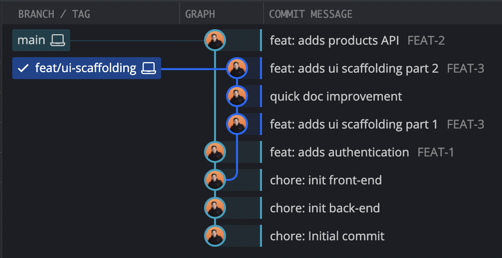
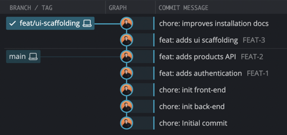

The first thing I do when I join a new project is to check the Git history.

The care and discipline put into a project’s Git history reflect the team’s overall quality and professionalism.

A clean, well-organized Git history indicates attention to code quality, teamwork, and long-term maintainability.

There are two things I pay attention to:
1. The quality of the commit messages
2. The quality of the Git history

## Writing good commit messages

The key is to pick a convention for the project and stick to it.
My recommendation in 99% of cases: [Conventional Commits](https://www.conventionalcommits.org/fr/v1.0.0/), 
it's widely used, well-documented, and there are plenty of tools that are based on it.

For personal projects I also use [gitmoji](https://gitmoji.dev/) as it makes it easy to identify the type of commit.

If you use a ticketing tool (Jira, Linear, Github Issues), a good practice that I advocate for is to always include
the ticket id in the commit description. 

## Keeping the Git history clean

The Git history is like a garden, if you don't care about it, you can end up in a mess.

Thankfully, Git provides plenty of tools to help you clean up your history; here is what I use daily :

### Amend

You need to fix the latest commit, reword its message, or add more changes to it?
That’s exactly what --amend is for.

Imagine, you just noticed a typo in the README.md file that you changed in your last commit.
Instead of creating a new commit "fix: typo in README", you can just amend the last commit like so: 

```bash
git add README.md # or whatever files you changed
git commit --amend 
```

I often use it to aggregate my changes in a single WIP commit.

### Rebase

Rebase is a complex tool, but it's powerful and probably my favorite.
Basically, it allows you to replay your commits on top of a new base (as the name suggests).

Let's say you want to retrieve the latest commit from the main branch and apply it on top of your current branch,
instead of merging it on your branch and dealing with a merge commit, you can rebase your branch on top of main.

```bash
git rebase main
```

This will replay your commits on top of main, and you will have a clean history as if you started from main.

#### Interactive rebase

This is just the tip of the iceberg, you can do a lot more with rebase.

Imagine the following situation, where I worked on my UI scaffolding feature and I'm ready to merge it into main.



There are three things I want to do :
1. Squash the two feature commits into one
2. Rename document fix with a proper message
3. Rebase the branch on top of main

**Step 1: Start the interactive rebase**

```bash
git rebase -i main
```

**Step 2: View and edit the rebase todo list**

The rebase will open a "todo list" your editor with a list of commits, like so :

```bash
pick b49beb2 # feat: adds ui scaffolding part 1
pick ed51a5c # quick doc improvement
pick 41a75c6 # feat: adds ui scaffolding part 2
```
The first letter of each commit indicates an action that will be performed on it,
and the order of the lines matters as it will be the order of the commits.

**Step 3: Edit the todo list**

For our example, here is what I would do :

```bash
pick b49beb2 # feat: adds ui scaffolding part 1
squash 41a75c6 # feat: adds ui scaffolding part 2
reword ed51a5c # quick doc improvement
```

1. I pick the first commit, which I want to keep
2. I move the "part 2" commit in the second position
3. I use squash to merge it into the first one
4. I use reword on the third commit, to change the message

At any point if you feel that you made a mistake, you can abort the rebase and come back to the original state with :
```
git rebase --abort
```

**Step 4: Push the new history to the remote**

And there it is, the history is clean and the branch is up to date with main !



As rebasing creates new commits, you may need to add the force option to your push command.
```bash
git push --force 
```

#### Fixup

Let's say you already have multiple commits on your branch and want to perform a fix on one of them.

You can use the fixup option to create a new commit that will fixup the targeted one.

```bash
git commit --fixup [id-of-the-commit-to-fix] 
```

When you run the rebase with --autosquash, Git automatically moves all fixup commits next to the commits they modify and squashes them for you.

```bash
git rebase -i --autosquash [where-to-rebase] 
```

There’s plenty more to learn about Git, but with those tools you are already well on your way to a clean Git history! 


