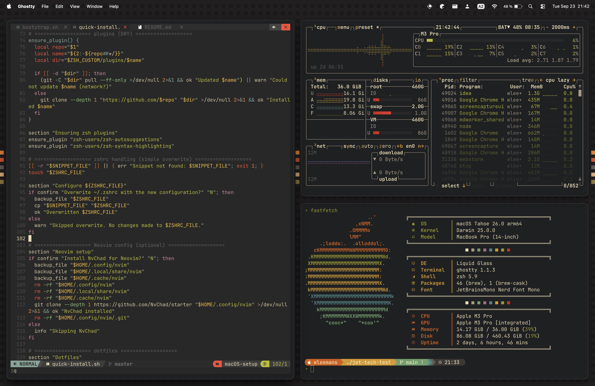

Mettre en place une nouvelle machine, c’est toujours un petit moment de plaisir pour moi.  

C’est l’occasion de repartir sur quelque chose de propre et d’optimisé.

## Pourquoi je suis passé au 14"

Ces dernières années, ma machine principale était un MacBook Pro 16". Grand écran, grosse batterie : parfait pour bosser confortablement.  

Mais en me déplaçant de plus en plus entre la maison, un client et le bureau de Jetdev, le 14" qui traînait en spare chez Jetdev a commencé à me faire de l'œil.

Au final, échanger un peu de surface d’écran contre de la portabilité m’a semblé être un bon compromis, alors j’ai sauté le pas.

> Mais pourquoi un Macbook Pro ?

Avec le temps, je trouve que macOS offre pile le bon équilibre entre environnement Unix et excellentes apps desktop. Le prix pique, mais côté qualité hardware, ça reste difficile à battre.

## Mon setup

En bon craftsman, je pense qu’il faut prendre soin de ses outils et les faire évoluer au fur et à mesure de nos besoins.
Et en tant que développeur, on a cette chance : nos outils sont non seulement efficaces, mais on peut aussi les rendre esthétiques et agréables à utiliser.

C’est pour ça que je n’utilise pas [Time Machine](https://support.apple.com/fr-fr/104984).

Là où certains trouvent ça pénible de reconfigurer un laptop, moi j’adore. C’est l’opportunité idéale pour nettoyer, affiner, et remettre mon environnement au carré.

Bien sûr, je ne repars jamais totalement de zéro.
J’ai un repository qui me sert de checklist et de boîte à scripts pour être opérationnel en quelques minutes.

### Paramètres système

macOS n’est pas l’OS le plus personnalisable du monde, mais quelques réglages bien choisis changent la vie.  

J’ai une checklist pour optimiser l’espace sur l’écran, rendre les inputs plus réactifs, et rendre le Finder un peu moins archaïque.

### Application de bureau

J’ai essayé de passer au 100% terminal mais dans la réalité, j'en reviens toujours à certaines apps desktop : les IDE JetBrains, Obsidian, etc.

Pour Git, j'utilise le terminal pour les fixups ou les rebases interactifs, mais GitKraken est plus rapide pour beaucoup de tâches de base.
Et l'intégration avec Github/Gitlab est vraiment bien.

Mes must-haves:

- Raycast au lieu de Spotlight, c'est rapide et il y a plein de plugins interessants.
- Rectangle pour la gestion simple et efficace des fenêtres. (Yabai/Aerospace sont cools, mais ça reste un peu “système D”.)
- Ghostty mon terminal préféré, léger et ultra réactif.
- Obsidian pour ma prise de notes.

### Terminal utilities & Dotfiles

Si je ne suis pas dans mon IDE, je suis dans un terminal.

J’utilise ZSH avec Starship pour le prompt, et je remplace les commandes classiques (`ls`, `cd`, `find`, `grep`) par des alternatives plus modernes et plus lisibles.

Tout est documenté dans mon repository : chaque outil, chaque config, tous mes dotfiles. Ça me permet d’avoir un shell cohérent d’une machine à l’autre, avec mes aliases et mes préférences toujours à portée.

> Les Dotfiles sont des fichiers de configuration cachés dans les systèmes Unix-like. Ils définissent le comportement de l’environnement, du shell et de ses outils.

### Scripts

Le repo contient aussi mes Brewfiles et quelques scripts pour bootstrap une machine en un clin d’œil.  
Il est ici : [Ly4m/macOS-setup](https://github.com/Ly4m/macOS-setup).

À chaque nouveau setup, je fais évoluer le repo : je retire ce qui ne me sert plus, j’ajoute des optimisations, et je simplifie au maximum.

## Esthétique

Au-delà de l’efficacité, j’accorde beaucoup d’importance à l’esthétique.  
Je passe mes journées devant cet écran, autant que ce soit agréable.

Pour cet automne, je suis parti sur le thème [Gruvbox](https://github.com/morhetz/gruvbox) : cozy et rétro. (Je blâme la nouvelle série *Alien* pour le retour du look “old-school futuriste”.)

C’est un détail, mais un bon thème change vraiment l’ambiance de travail.

## Au final

Le passage au 14" est une bonne surprise : bien plus confortable pour bouger, et comme je travaille 95% du temps sur un moniteur externe, je ne ressens presque jamais le manque d’espace.

La plus petite batterie se fait par contre sentir.

Un laptop plus compact, un setup propre et un thème qui met dans l’ambiance.
De retour de vacances, ça fait du bien de repartir sur une base fraîche pour construire de nouveaux projets.

Si mon setup vous intrigue, ou si vous pensez à créer votre propre repository, n’hésitez pas à me contacter.  
Je suis toujours partant pour partager des astuces, aider à débug un script ou réfléchir à la structure d’un repo.

Les bons outils, c'est quelque chose de personnel :
- La moitié du plaisir, c’est de construire son setup.
- L’autre moitié, c’est d’apprécier ce que vous créez avec !